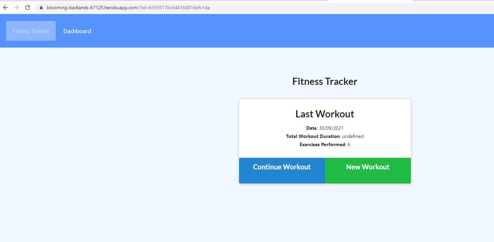
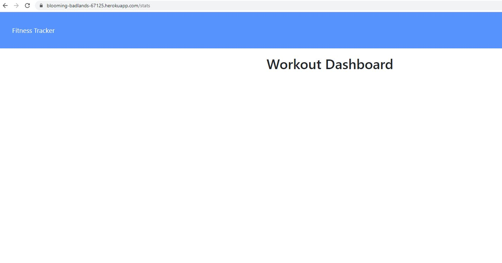

# track-and-improve
A workout tracker deployed on Heroku with a Mongo database and a Mongoose schema.

[](https://opensource.org/licenses/MIT)


## Description
An app deployed on Heroku which allows people who want to track their exercise and training sessions to do so quickly and easily.  This app required a Mongo database (via Mongo Atlas) to be created using a Mongoose schema for the Workouts and handles routes with Express.  The Heroku app is linked to the code repository in GitHub so that any code updates can flow through to the app automatically. 

## User Story
```md
As a user, I want to be able to view, create and track daily workouts.
I want to be able to log multiple exercises in a workout on a given day.
I should also be able to track the name, type, weight, sets, reps and duration of exercise.
If the exercise is a cardio exercise, I should be able to track my distance travelled.
As the saying goes, you can't improve what you don't track!
```

## Screenshot
.

.

## Installation
When running locally, type the following commands into your terminal:
`npm install`
`npm run seed`
`npm run watch`
`npm start`

When given the message "App running on port 3001!", open localhost:3001 & add exercise details for your workout, as relevant.

Otherwise, open the Heroku URL (below) & add exercise details for each of your workouts and check your dashboard for your workout history.

https://blooming-badlands-67125.herokuapp.com/

# Usage
The user will be presented with a homepage ready to begin a new workout or add to an existing workout for the day.  All required inputs have suggested responses or placeholders to assist the user.  Once information has been added, the user can click on the dashboard link to see their 7-day history.

## Future Work and Upgrades
1. Workout duration calculation - now is undefined
2. Dashboard - seeded data not currently showing in Dashboard
3. Add some motivation icons and messages to encourage the user to strive harder in their daily exercises

## GitHub Respository URL
https://github.com/rachel-brain/track-and-improve

## Application deployed on Heroku URL
https://blooming-badlands-67125.herokuapp.com/

## Contact
https://github.com/rachel-brain

rachel.brain@internode.on.net